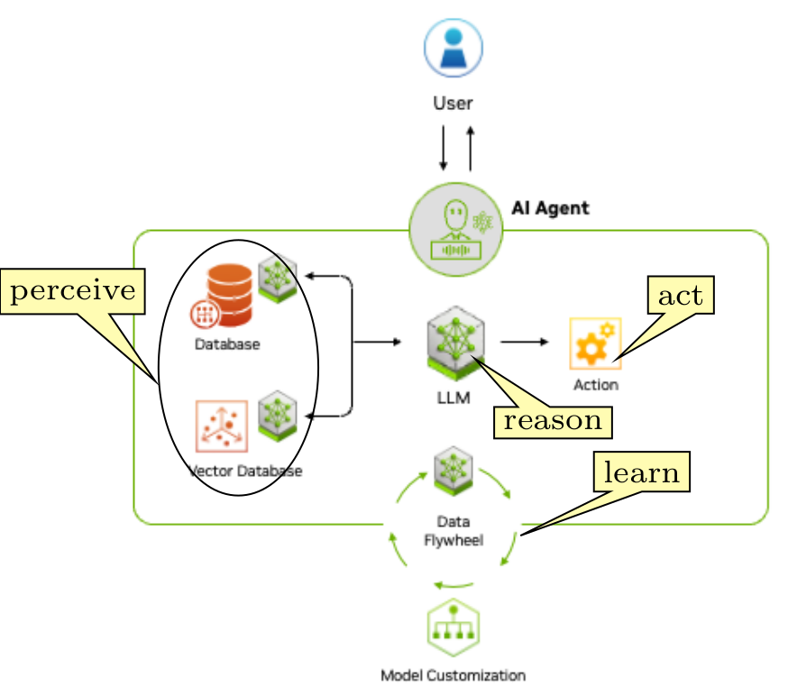

## Agentic AI Browser

Agentic AI is going to change the way we handle our workflow. It provides an autonomous system that can perform complex tasks with minimal human intervention. It can interpret context, evaluate available options, and adapt to the environment to achieve the initially set goals. The four steps of agentic AI software are **perceive**, **reason**, **act**, and **learn**, as indicated by the figure below.

  

  

The data flywheel is the feedback loop where data generated from the agent's interactions is fed back to enhance the learning. LLM works as an orchestrator (reasoning engine). Specific domain knowledge from a local knowledge base may help to augment or refine the quality of outputs. Sufficient guardrails have to be embedded into AI agents when they interact with other applications and software tools and perform critical actions on behalf of humans.

Perplexity has announced the launch of its agentic browser called Comet. While the Comet launch is awaited, there is a GitHub repository where we can download and play with a Python-powered agentic browser. An agentic AI browser has three principal agents: Planner, Browser, and Critique, as shown in the figure below.

The <a href="https://github.com/TheAgenticAI/TheAgenticBrowser"> GitHub repository</a> gives detailed instructions for downloading and installing the system.
